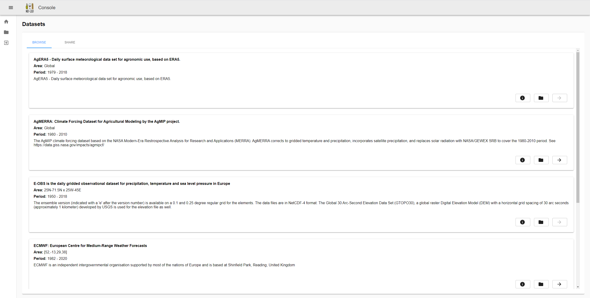
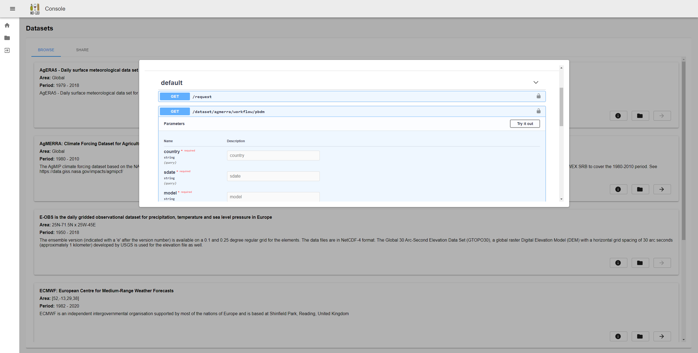
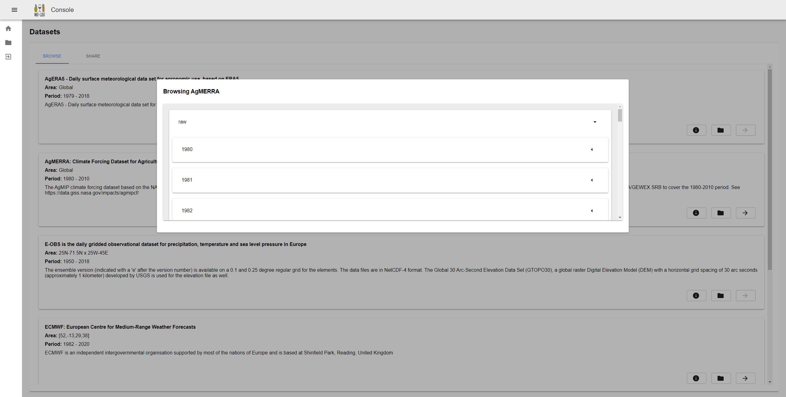
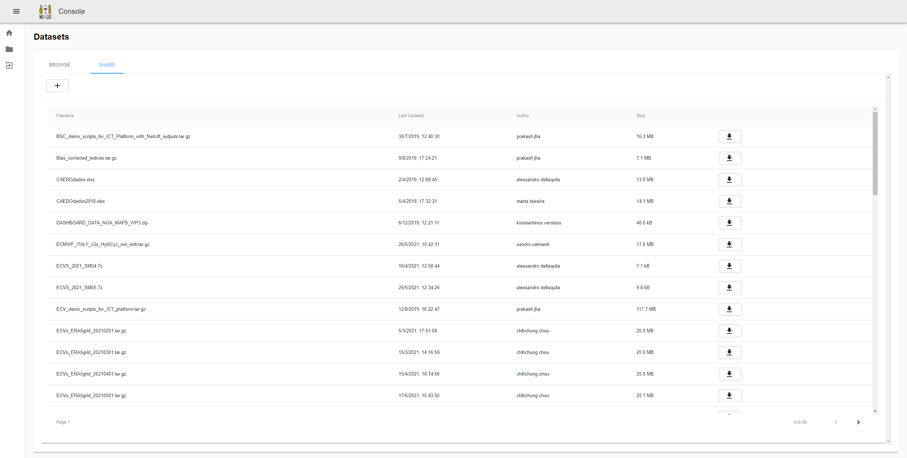

# MedGold Platform Storage Frontend

This web application is written in React.js, and allows the users to:
- list all available datasets



- for each dataset: browse MedGold API through Swagger (OpenAPI 2) documentation-like component



- for each dataset: browse its files



- browse, download and upload files to the shared file repository of the MedGold project



## Prerequisites

```
npm version: 6.11.3
node version: 10.17.0
```

## Build

```bash
npm install
npm run build
```

## Run local

```bash
npm install
npm start
```